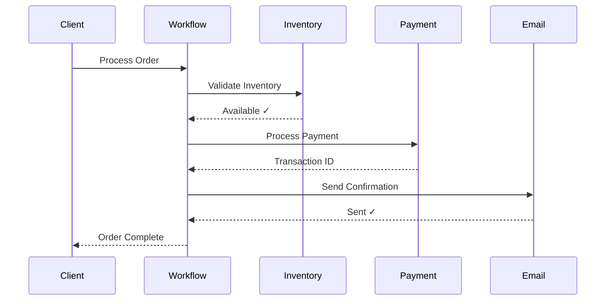

# Order Processing Example

A complete e-commerce order processing workflow example using `Result` / `AsyncResult` from unthrown.

## Overview

This example demonstrates:

- **Separated contract package**: Contract is in its own package that can be shared
- **Result / AsyncResult pattern**: Explicit error handling with type-safe errors
- Order validation
- Payment processing
- Inventory management
- Email notifications
- Clean Architecture structure

## Workflow Flow



## Project Structure

The example consists of two packages:

```
examples/
├── order-processing-contract/    # Contract package (shared)
│   ├── src/
│   │   ├── contract.ts                 # Contract definition
│   │   ├── schemas.ts                  # Domain schemas
│   │   └── index.ts                    # Package exports
│   └── package.json
│
└── order-processing-worker/             # Worker/Client implementation
    ├── src/
    │   ├── application/
    │   │   ├── activities.ts           # Activity implementations (AsyncResult)
    │   │   ├── workflows.ts            # Workflow implementations
    │   │   ├── worker.ts               # Worker setup
    │   │   └── client.ts               # Client example
    │   ├── domain/                     # Business logic
    │   └── infrastructure/             # External adapters
    └── package.json                    # Imports contract package
```

## Key Concepts

### Contract Package

The contract is separated into its own package (`order-processing-contract`) which:

- Can be imported by the worker to implement workflows/activities
- Can be imported by clients (even in other applications) to consume the workflow
- Provides full TypeScript type safety across all boundaries
- Can be versioned and published independently

### Result / AsyncResult Pattern

This example demonstrates the unthrown-based pattern:

- **unthrown** is used in activities, workflows, and clients — one library
  covers every context
- Activities return `AsyncResult<T, ApplicationFailure>` instead of throwing
- Child workflow calls return `Result<T, E>` for explicit error handling
- Errors are part of the type signature
- Enables railway-oriented programming via `.flatMap` / `.map` / `.mapErr`

### Worker Application

The worker application imports the contract package and implements:

- Activities that match the contract signatures with `AsyncResult`
- Workflows that use the contract's type definitions
- Worker setup that registers the implementations

## Source Code

View the complete source code:

- [Contract package](https://github.com/btravstack/temporal-contract/tree/main/examples/order-processing-contract)
- [Worker/Client application](https://github.com/btravstack/temporal-contract/tree/main/examples/order-processing-worker)

## Running the Example

### Prerequisites

1. Start Temporal server:
   ```bash
   temporal server start-dev
   ```

### Run the Example

```bash
# Build the contract package first
cd examples/order-processing-contract
pnpm build

# Run the worker
cd ../order-processing-worker
pnpm dev  # Terminal 1 - Start worker

# In another terminal, run the client
cd ../order-processing-client
pnpm dev  # Terminal 2 - Run client
```

## Benefits of This Architecture

1. **Contract Reusability**: The contract can be imported by multiple applications
2. **Type Safety**: Full TypeScript support with `Result` / `AsyncResult` types
3. **Explicit Error Handling**: Errors are part of the type system
4. **Independent Deployment**: Client and worker can be in different repositories
5. **Clear Separation**: Contract definition is separate from implementation

See [Examples Overview](/examples/) and [Result Pattern Guide](/guide/result-pattern) for more details.
