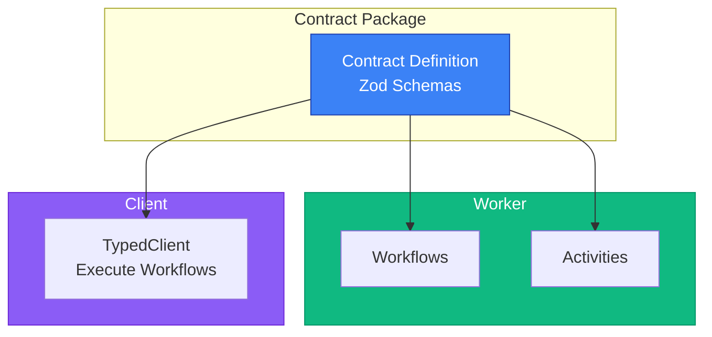

# Examples

Learn by example! Explore complete working examples that demonstrate temporal-contract in action.

## Architecture Overview



## Available Examples

### [Order Processing Example](/examples/basic-order-processing)

A complete e-commerce order processing workflow using `Result` / `ResultAsync` from neverthrow for explicit error handling.

**Features:**

- Type-safe error handling with `Result<T, E>`
- Order validation
- Payment processing
- Inventory management
- Email notifications
- Clean Architecture structure

**Best for:** Understanding temporal-contract with modern, type-safe error handling.

## Running the Examples

All examples are located in the [`examples/`](https://github.com/btravers/temporal-contract/tree/main/examples) directory of the repository.

### Prerequisites

1. Clone the repository:

   ```bash
   git clone https://github.com/btravers/temporal-contract.git
   cd temporal-contract
   ```

2. Install dependencies:

   ```bash
   pnpm install
   ```

3. Build the packages:

   ```bash
   pnpm build
   ```

4. Start Temporal server:
   ```bash
   temporal server start-dev
   ```

### Running an Example

Each example has its own directory with a README:

```bash
# Navigate to an example
cd examples/order-processing-worker

# Start the worker
pnpm dev

# In another terminal, run the client
cd examples/order-processing-client
pnpm dev
```

## Example Structure

Each example follows this structure:

```
examples/
├── example-contract/              # Shared contract package
│   ├── src/
│   │   └── contract.ts            # Contract definition
│   └── package.json
├── example-worker/                # Worker implementation
│   ├── src/
│   │   ├── application/
│   │   │   ├── activities.ts      # Activity implementations
│   │   │   ├── workflows.ts       # Workflow implementations
│   │   │   └── worker.ts          # Worker setup
│   │   ├── domain/                # Business logic / use cases
│   │   └── infrastructure/        # External adapters
│   └── package.json
└── example-client/                # Client application
    ├── src/
    │   └── client.ts              # Example client
    └── package.json
```

## Code Snippets

### Contract Definition

All examples start with a contract:

```typescript
import { defineContract } from "@temporal-contract/contract";
import { z } from "zod";

export const orderContract = defineContract({
  taskQueue: "orders",

  activities: {
    sendEmail: {
      input: z.object({
        to: z.string().email(),
        subject: z.string(),
        body: z.string(),
      }),
      output: z.object({ sent: z.boolean() }),
    },
  },

  workflows: {
    processOrder: {
      input: z.object({
        orderId: z.string(),
        customerId: z.string(),
        items: z.array(
          z.object({
            sku: z.string(),
            quantity: z.number().positive(),
          }),
        ),
      }),
      output: z.object({
        success: z.boolean(),
        transactionId: z.string().optional(),
      }),

      activities: {
        validateInventory: {
          input: z.object({ items: z.array(z.any()) }),
          output: z.object({ available: z.boolean() }),
        },
        processPayment: {
          input: z.object({
            customerId: z.string(),
            amount: z.number(),
          }),
          output: z.object({
            transactionId: z.string(),
            success: z.boolean(),
          }),
        },
      },
    },
  },
});
```

### Activity Implementation

Clean, typed activity implementations with `ResultAsync`:

```typescript
import { declareActivitiesHandler, ApplicationFailure } from "@temporal-contract/worker/activity";
import { ResultAsync } from "neverthrow";
import { orderContract } from "../contracts/order.contract";
import { emailService } from "../infrastructure/email.service";
import { paymentService } from "../infrastructure/payment.service";

export const activities = declareActivitiesHandler({
  contract: orderContract,
  activities: {
    sendEmail: ({ to, subject, body }) =>
      ResultAsync.fromPromise(emailService.send({ to, subject, body }), (error) =>
        ApplicationFailure.create({
          type: "EMAIL_FAILED",
          message: error instanceof Error ? error.message : "Failed to send email",
          ...(error instanceof Error ? { cause: error } : {}),
        }),
      ).map(() => ({ sent: true })),

    processOrder: {
      validateInventory: ({ items }) =>
        ResultAsync.fromPromise(inventoryService.checkAvailability(items), (error) =>
          ApplicationFailure.create({
            type: "INVENTORY_CHECK_FAILED",
            message: "Failed to check inventory",
            cause: error instanceof Error ? error : undefined,
          }),
        ).map((available) => ({ available })),

      processPayment: ({ customerId, amount }) =>
        ResultAsync.fromPromise(paymentService.charge(customerId, amount), (error) =>
          ApplicationFailure.create({
            type: "PAYMENT_FAILED",
            message: "Failed to process payment",
            cause: error instanceof Error ? error : undefined,
          }),
        ).map((result) => ({
          transactionId: result.id,
          success: result.status === "success",
        })),
    },
  },
});
```

### Workflow Implementation

Type-safe workflow with full autocomplete:

```typescript
import { declareWorkflow } from "@temporal-contract/worker/workflow";
import { orderContract } from "../contracts/order.contract";

export const processOrder = declareWorkflow({
  workflowName: "processOrder",
  contract: orderContract,
  activityOptions: { startToCloseTimeout: "1 minute" },
  implementation: async (context, { orderId, customerId, items }) => {
    // Validate inventory
    const inventory = await context.activities.validateInventory({ items });

    if (!inventory.available) {
      await context.activities.sendEmail({
        to: customerId,
        subject: "Order Failed",
        body: "Items not available",
      });
      return { success: false };
    }

    // Calculate total
    const total = items.reduce((sum, item) => sum + item.quantity * 100, 0);

    // Process payment
    const payment = await context.activities.processPayment({
      customerId,
      amount: total,
    });

    if (!payment.success) {
      await context.activities.sendEmail({
        to: customerId,
        subject: "Payment Failed",
        body: "Unable to process payment",
      });
      return { success: false };
    }

    // Send confirmation
    await context.activities.sendEmail({
      to: customerId,
      subject: "Order Confirmed",
      body: `Order ${orderId} confirmed. Transaction: ${payment.transactionId}`,
    });

    return {
      success: true,
      transactionId: payment.transactionId,
    };
  },
});
```

## Learn More

- 📚 Read the [Getting Started Guide](/guide/getting-started)
- 🔍 Understand [Core Concepts](/guide/core-concepts)
- 📖 Browse the [API Reference](/api/)

## Contributing Examples

Have an interesting use case? We welcome example contributions! See our [Contributing Guide](https://github.com/btravers/temporal-contract/blob/main/CONTRIBUTING.md).
