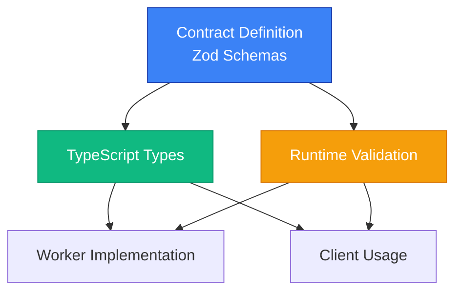
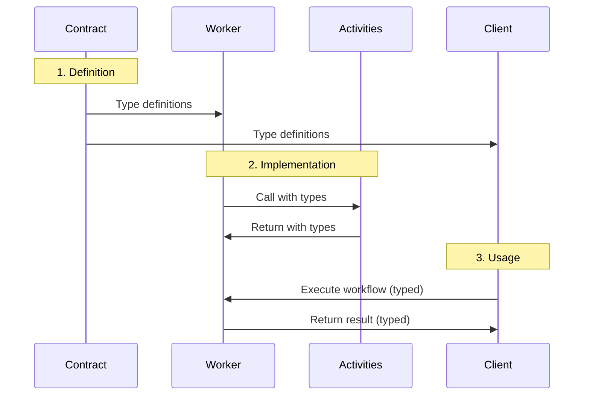

# Core Concepts

This guide explains the fundamental concepts behind temporal-contract.

## Contract-First Architecture

temporal-contract uses a **contract-first** approach. You define your workflow interfaces once using Zod schemas, and everything else flows from there:



```typescript
const contract = defineContract({
  taskQueue: "my-queue",
  workflows: {
    myWorkflow: {
      input: z.object({
        /* ... */
      }),
      output: z.object({
        /* ... */
      }),
      activities: {
        /* ... */
      },
    },
  },
});
```

This single definition provides:

- ✅ Type inference for implementations
- ✅ Automatic validation at runtime
- ✅ Compile-time type checking
- ✅ IDE autocomplete and hints

## Three Layers of Type Safety

temporal-contract provides type safety at three levels:



### 1. Contract Definition

The contract defines the shape of your workflows using Zod schemas:

```typescript
import { defineContract } from "@temporal-contract/contract";
import { z } from "zod";

const contract = defineContract({
  taskQueue: "orders",
  workflows: {
    processOrder: {
      input: z.object({
        orderId: z.string(),
        amount: z.number().positive(),
      }),
      output: z.object({
        success: z.boolean(),
        transactionId: z.string(),
      }),
      activities: {
        /* ... */
      },
    },
  },
});
```

### 2. Implementation

Implementations receive fully typed parameters and must return correctly typed results:

```typescript
import { declareWorkflow } from "@temporal-contract/worker/workflow";

export const processOrder = declareWorkflow({
  workflowName: "processOrder",
  contract,
  activityOptions: { startToCloseTimeout: "1 minute" },
  implementation: async (context, args) => {
    // args is typed as { orderId: string, amount: number }
    // return type must match { success: boolean, transactionId: string }

    const payment = await context.activities.processPayment({
      amount: args.amount,
    });

    return {
      success: true,
      transactionId: payment.transactionId,
    };
  },
});
```

### 3. Client Usage

The client provides type-safe workflow execution:

```typescript
import { Client } from "@temporalio/client";
import { TypedClient } from "@temporal-contract/client";

const temporalClient = new Client({ connection });
const client = TypedClient.create(contract, temporalClient);

// TypeScript knows the exact argument types
const result = await client.executeWorkflow("processOrder", {
  workflowId: "order-123",
  args: { orderId: "ORD-123", amount: 100 },
});

// result is a Result — use .match({ ok, err, defect }) or isOk(result) to unwrap
result.match({
  ok: (output) => console.log(output.transactionId),
  err: (error) => console.error("Workflow failed:", error),
  defect: (cause) => console.error("Unexpected failure:", cause),
});
```

## Activities: Global vs Workflow-Specific

temporal-contract supports two types of activities:

### Global Activities

Activities available to **all workflows** in the contract:

```typescript
const contract = defineContract({
  taskQueue: "orders",

  // Global activities
  activities: {
    sendEmail: {
      input: z.object({ to: z.string(), body: z.string() }),
      output: z.object({ sent: z.boolean() }),
    },
    logEvent: {
      input: z.object({ event: z.string(), data: z.any() }),
      output: z.object({ logged: z.boolean() }),
    },
  },

  workflows: {
    /* ... */
  },
});
```

### Workflow-Specific Activities

Activities scoped to a **specific workflow**:

```typescript
const contract = defineContract({
  taskQueue: "orders",
  workflows: {
    processOrder: {
      input: z.object({ orderId: z.string() }),
      output: z.object({ success: z.boolean() }),

      // Only available in processOrder workflow
      activities: {
        validateInventory: {
          input: z.object({ orderId: z.string() }),
          output: z.object({ available: z.boolean() }),
        },
        chargePayment: {
          input: z.object({ amount: z.number() }),
          output: z.object({ transactionId: z.string() }),
        },
      },
    },
  },
});
```

## Automatic Validation

All inputs and outputs are validated automatically using Zod:


```typescript
// If validation fails, you get a clear error
const result = await client.executeWorkflow("processOrder", {
  workflowId: "order-123",
  args: { orderId: 123 }, // ❌ Error: orderId must be a string
});
```

Validation happens at:

- **Workflow entry** — Input validation
- **Workflow exit** — Output validation
- **Activity calls** — Input/output validation
- **Client calls** — Argument validation

## Type Inference

TypeScript automatically infers types from your Zod schemas:

```typescript
// Define once
const schema = z.object({
  orderId: z.string(),
  items: z.array(
    z.object({
      sku: z.string(),
      quantity: z.number(),
    }),
  ),
});

// TypeScript knows the exact type:
type Order = z.infer<typeof schema>;
// {
//   orderId: string;
//   items: Array<{ sku: string; quantity: number }>;
// }
```

This means you never need to write types manually — they're derived from your schemas.

## Contract Composition

You can compose contracts for better organization:

```typescript
// Shared activities
const emailActivities = {
  sendEmail: {
    input: z.object({ to: z.string(), body: z.string() }),
    output: z.object({ sent: z.boolean() }),
  },
};

// Contract 1
const ordersContract = defineContract({
  taskQueue: "orders",
  activities: emailActivities,
  workflows: {
    /* ... */
  },
});

// Contract 2 (reusing activities)
const shipmentsContract = defineContract({
  taskQueue: "shipments",
  activities: emailActivities,
  workflows: {
    /* ... */
  },
});
```

## Best Practices

### 1. Keep Contracts Small

Define focused contracts for specific domains:

```typescript
// ✅ Good - focused contract
const ordersContract = defineContract({
  taskQueue: "orders",
  workflows: {
    processOrder: {
      /* ... */
    },
    cancelOrder: {
      /* ... */
    },
  },
});

// ❌ Avoid - too broad
const everythingContract = defineContract({
  taskQueue: "everything",
  workflows: {
    processOrder: {
      /* ... */
    },
    sendEmail: {
      /* ... */
    },
    updateInventory: {
      /* ... */
    },
    // ... 50 more workflows
  },
});
```

### 2. Use Descriptive Schemas

Make your schemas self-documenting:

```typescript
// ✅ Good
input: z.object({
  orderId: z.string().uuid().describe("Unique order identifier"),
  amount: z.number().positive().describe("Order amount in cents"),
  customerId: z.string().email().describe("Customer email address"),
});

// ❌ Avoid
input: z.object({
  id: z.string(),
  amt: z.number(),
  cid: z.string(),
});
```

### 3. Validate Early

Use Zod's refinements for complex validation:

```typescript
input: z.object({
  startDate: z.date(),
  endDate: z.date(),
}).refine((data) => data.endDate > data.startDate, {
  message: "End date must be after start date",
});
```

## What's Next?

- Learn about [Worker Implementation](/guide/worker-implementation)
- Explore [Entry Points Architecture](/guide/entry-points)
- Check out complete [Examples](/examples/)
