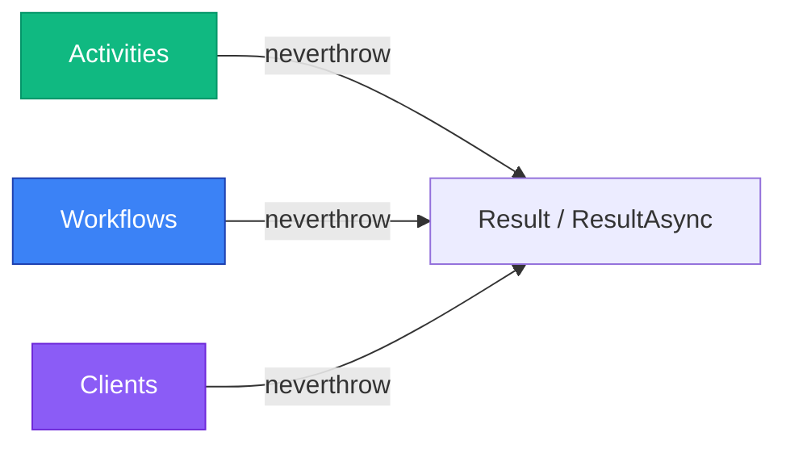
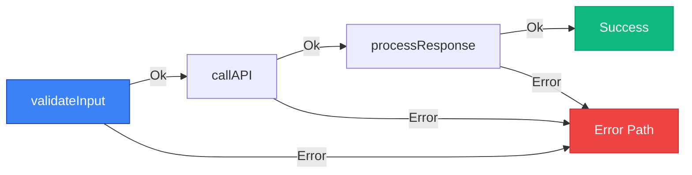

# Result Pattern

Learn how to use explicit error handling with the `Result` / `ResultAsync`
pattern from [neverthrow].

[neverthrow]: https://github.com/supermacro/neverthrow

## Overview

temporal-contract uses neverthrow's `Result<T, E>` and `ResultAsync<T, E>`
types throughout its public surface:

- **Activities** return `ResultAsync<T, ApplicationFailure>`.
- **Workflows** await activities and child workflows; the framework unwraps
  the `Result` for activities (so a workflow sees a plain value or a thrown
  error) and surfaces `Result` directly for child workflows.
- **Clients** await `ResultAsync<T, E>`; the resolved value is a
  `Result<T, E>` that you destructure with `.match(okFn, errFn)` or
  `.isOk()` / `.isErr()`.

A single library covers every context — the same import works inside
activities, workflows, and clients.



## Installation

```bash
pnpm add neverthrow
```

`ResultAsync<T, E>` is awaitable: `await resultAsync` resolves to
`Result<T, E>`. The underlying Promise is constructed when the chain runs,
so the type behaves like a lazy task — call sites that already `await` the
value before checking `.isOk()` / `.isErr()` need no changes.

## Basic Usage

### Activities

Activities return `ResultAsync<T, ApplicationFailure>`. The cleanest shape
is `ResultAsync.fromPromise(promise, mapError)`:

```typescript
import { declareActivitiesHandler, ApplicationFailure } from "@temporal-contract/worker/activity";
import { ResultAsync } from "neverthrow";
import { orderContract } from "./contract";

export const activities = declareActivitiesHandler({
  contract: orderContract,
  activities: {
    processPayment: ({ amount }) =>
      ResultAsync.fromPromise(paymentGateway.charge(amount), (error) =>
        ApplicationFailure.create({
          type: "PAYMENT_FAILED",
          message: error instanceof Error ? error.message : "Payment failed",
          cause: error instanceof Error ? error : undefined,
        }),
      ).map((txId) => ({ transactionId: txId, success: true })),

    sendEmail: ({ to, body }) =>
      ResultAsync.fromPromise(emailService.send({ to, body }), (error) =>
        ApplicationFailure.create({
          type: "EMAIL_FAILED",
          message: error instanceof Error ? error.message : "Email failed",
          cause: error instanceof Error ? error : undefined,
        }),
      ).map(() => ({ sent: true })),
  },
});
```

### Workflows

Workflows await activities and child workflows directly. Activities return
plain values inside the workflow body (the framework unwraps the
`Result`); child workflows surface `Result` so the workflow can branch on
success vs. failure without throwing:

```typescript
import { declareWorkflow } from "@temporal-contract/worker/workflow";
import { orderContract } from "./contract";

export const processOrder = declareWorkflow({
  workflowName: "processOrder",
  contract: orderContract,
  activityOptions: { startToCloseTimeout: "1 minute" },
  implementation: async (context, args) => {
    // Process payment - activities return plain values
    const payment = await context.activities.processPayment({ amount: args.amount });

    // Send confirmation email
    await context.activities.sendEmail({
      to: "customer@example.com",
      body: `Order ${args.orderId} confirmed`,
    });

    return {
      success: true,
      transactionId: payment.transactionId,
    };
  },
});
```

### Clients

Clients receive a `ResultAsync<T, E>` from `executeWorkflow` /
`startWorkflow`. Awaiting it yields a `Result<T, E>`:

```typescript
import { TypedClient } from "@temporal-contract/client";
import { Client } from "@temporalio/client";
import { orderContract } from "./contract";

const temporalClient = new Client({ connection });

const client = TypedClient.create(orderContract, temporalClient);
const result = await client.executeWorkflow("processOrder", {
  workflowId: "order-123",
  args: { orderId: "ORD-123", amount: 100 },
});

// Handle result with pattern matching (positional callbacks)
result.match(
  (value) => {
    console.log("Order processed:", value.transactionId);
  },
  (error) => {
    console.error("Order failed:", error);
  },
);
```

## Awaiting and inspecting

`ResultAsync<T, E>` is a thin wrapper around a `Promise<Result<T, E>>`. You
can `await` it once and then inspect synchronously, or chain with
`.map`, `.mapErr`, `.andThen`, `.orElse` before awaiting:

```typescript
const result = await client.executeWorkflow("processOrder", {
  workflowId: "order-123",
  args: { orderId: "ORD-123", amount: 100 },
});

if (result.isErr()) {
  console.error(result.error);
  return;
}

console.log(result.value);
```

## Pattern Matching

Activities return plain values when called from workflows. If an activity
fails, the framework rethrows the `ApplicationFailure` so workflow code can
catch it like any other Temporal failure:

```typescript
export const processOrder = declareWorkflow({
  workflowName: "processOrder",
  contract: orderContract,
  activityOptions: { startToCloseTimeout: "1 minute" },
  implementation: async (context, args) => {
    try {
      // Activity returns plain value (Result is unwrapped internally)
      const payment = await context.activities.processPayment({ amount: 100 });
      console.log("Payment succeeded:", payment.transactionId);

      return { success: true, transactionId: payment.transactionId };
    } catch (error) {
      // Activity errors are thrown
      console.error("Payment failed:", error);
      return { success: false, transactionId: "" };
    }
  },
});
```

> [!NOTE]
> For child workflows, you do get `Result` objects. See the Child Workflows section below.

## Chaining Activities

When calling multiple activities, use standard async/await with try/catch:

```typescript
export const processOrder = declareWorkflow({
  workflowName: "processOrder",
  contract: orderContract,
  activityOptions: { startToCloseTimeout: "1 minute" },
  implementation: async (context, args) => {
    try {
      // Activities return plain values
      const payment = await context.activities.processPayment({ amount: 100 });

      // Next activity only runs if payment succeeded
      await context.activities.sendEmail({
        to: "customer@example.com",
        body: `Payment ${payment.transactionId} processed`,
      });

      // Update database
      await context.activities.updateDatabase({
        status: "completed",
      });

      return { success: true };
    } catch (error) {
      console.error("Workflow failed:", error);
      return { success: false };
    }
  },
});
```

## Error Types

Define typed errors in your activities:

```typescript
import { ResultAsync } from "neverthrow";
import { ApplicationFailure } from "@temporal-contract/worker/activity";

type PaymentError =
  | { type: "InsufficientFunds" }
  | { type: "CardDeclined" }
  | { type: "NetworkError"; message: string };

type EmailError = { type: "InvalidEmail" } | { type: "ServiceUnavailable" };

// Activities return ResultAsync with typed errors
processPayment: ({ amount }) =>
  ResultAsync.fromPromise(paymentGateway.charge(amount), (error) => {
    // Wrap domain errors in ApplicationFailure so Temporal applies the
    // configured retry policy; set `nonRetryable: true` for permanent
    // failures.
    return ApplicationFailure.create({
      type: "PAYMENT_FAILED",
      message: error instanceof Error ? error.message : "Payment failed",
      ...(error instanceof Error ? { cause: error } : {}),
    });
  }).map((txId) => ({ transactionId: txId }));
```

## Benefits

### 1. Explicit Error Handling

Activities use the `ResultAsync` pattern internally, while workflows use
try/catch:

```typescript
import { ResultAsync } from "neverthrow";

// Activity implementation (uses ResultAsync)
const processPayment = ({ amount }) =>
  ResultAsync.fromPromise(paymentGateway.charge(amount), (error) =>
    ApplicationFailure.create({
      type: "PAYMENT_FAILED",
      message: "Payment failed",
      cause: error instanceof Error ? error : undefined,
    }),
  ).map((txId) => ({ transactionId: txId }));

// Workflow (uses standard try/catch for activities)
export const processOrder = declareWorkflow({
  workflowName: "processOrder",
  contract: myContract,
  activityOptions: { startToCloseTimeout: "1 minute" },
  implementation: async (context, args) => {
    try {
      // Activity returns plain value
      const payment = await context.activities.processPayment({ amount: 100 });
      return { success: true, transactionId: payment.transactionId };
    } catch (error) {
      // Handle activity error
      return { success: false };
    }
  },
});
```

### 2. No Hidden Exceptions in Activities

Activities explicitly return `ResultAsync` instead of throwing:

```typescript
// ✅ Clear - activity returns ResultAsync<T, ApplicationFailure>
const processPayment = ({ amount }) =>
  ResultAsync.fromPromise(paymentGateway.charge(amount), (error) =>
    ApplicationFailure.create({
      type: "PAYMENT_FAILED",
      message: "Payment failed",
      cause: error instanceof Error ? error : undefined,
    }),
  ).map((txId) => ({ transactionId: txId }));

// ❌ Unclear - might throw anything
async function processPayment({ amount }) {
  const txId = await paymentGateway.charge(amount);
  return { transactionId: txId };
}
```

### 3. Railway-Oriented Programming (Activities)

Activity implementations can chain operations that short-circuit on error
using `.andThen` (the neverthrow equivalent of boxed's `.flatMap`):



```typescript
// Activity implementation with chaining
const processOrder = ({ orderId }) =>
  validateOrderId(orderId)
    .andThen((validId) => fetchOrder(validId))
    .andThen((order) => processPayment(order))
    .andThen((payment) => updateDatabase(payment))
    .mapErr((error) =>
      ApplicationFailure.create({
        type: "ORDER_FAILED",
        message: "Order processing failed",
        cause: error instanceof Error ? error : undefined,
      }),
    );
// Stops at first error
```

### 4. Partial Success Handling

Track partial success in complex workflows using try/catch blocks:

```typescript
export const processOrder = declareWorkflow({
  workflowName: "processOrder",
  contract: orderContract,
  activityOptions: { startToCloseTimeout: "1 minute" },
  implementation: async (context, args) => {
    let paymentTransactionId: string | undefined;

    try {
      // Step 1: Process payment
      const payment = await context.activities.processPayment({ amount: args.amount });
      paymentTransactionId = payment.transactionId;

      // Step 2: Schedule shipment
      await context.activities.scheduleShipment({ orderId: args.orderId });

      return { success: true, transactionId: paymentTransactionId };
    } catch (error) {
      // Payment succeeded but shipment failed - can handle specially
      if (paymentTransactionId) {
        // Rollback payment
        await context.activities.refundPayment({ transactionId: paymentTransactionId });

        return {
          success: false,
          message: "Shipment failed, payment refunded",
          completedSteps: { payment: paymentTransactionId },
        };
      }

      return { success: false, message: "Payment failed" };
    }
  },
});
```

## Combining results

neverthrow exposes `Result.combine([...])` to fan in a list of `Result`s
into a single `Result<T[], E>` that fails on the first error. There is no
direct equivalent of boxed's `Result.allFromDict({...})` — destructure the
combined array, or call `.match` per entry:

```typescript
import { Result } from "neverthrow";

const combined = Result.combine([validateA(a), validateB(b), validateC(c)]);

return combined.match(
  ([resA, resB, resC]) => proceed({ resA, resB, resC }),
  (error) => fail(error),
);
```

## Child Workflows

Child workflows return `ResultAsync` for consistent error handling:

### Execute and Wait

```typescript
import { declareWorkflow } from "@temporal-contract/worker/workflow";

export const parentWorkflow = declareWorkflow({
  workflowName: "parentWorkflow",
  contract: myContract,
  activityOptions: { startToCloseTimeout: "1 minute" },
  implementation: async (context, args) => {
    // Execute child workflow and wait for result
    const result = await context.executeChildWorkflow(myContract, "processPayment", {
      workflowId: `payment-${args.orderId}`,
      args: { amount: args.totalAmount },
    });

    // Workflows return plain objects, not Result
    return result.match(
      (output) => ({
        success: true,
        transactionId: output.transactionId,
      }),
      (error) => ({
        success: false,
        error: error.message,
      }),
    );
  },
});
```

### Start Without Waiting

```typescript
export const parentWorkflow = declareWorkflow({
  workflowName: "parentWorkflow",
  contract: myContract,
  activityOptions: { startToCloseTimeout: "1 minute" },
  implementation: async (context, args) => {
    // Start child workflow without waiting
    const handleResult = await context.startChildWorkflow(myContract, "sendNotification", {
      workflowId: `notification-${args.orderId}`,
      args: { message: "Order received" },
    });

    handleResult.match(
      async (handle) => {
        // Child started successfully
        // Can wait for result later if needed
        const result = await handle.result();
      },
      (error) => {
        console.error("Failed to start child:", error);
      },
    );

    // Workflows return plain objects, not Result
    return { success: true };
  },
});
```

### Cross-Contract Child Workflows

Invoke workflows from different contracts/workers:

```typescript
import { orderContract, notificationContract } from "./contracts";

export const orderWorkflow = declareWorkflow({
  workflowName: "processOrder",
  contract: orderContract,
  activityOptions: { startToCloseTimeout: "1 minute" },
  implementation: async (context, args) => {
    // Child workflow from another contract
    const notifyResult = await context.executeChildWorkflow(
      notificationContract,
      "sendOrderConfirmation",
      {
        workflowId: `notify-${args.orderId}`,
        args: { orderId: args.orderId },
      },
    );

    // Workflows return plain objects, not Result
    return notifyResult.match(
      () => ({ status: "completed" }),
      (error) => ({
        status: "failed",
        error: error.message,
      }),
    );
  },
});
```

## When to Use

### Use `Result` / `ResultAsync` When:

- **In Activity Implementations**: Always use `ResultAsync` for explicit error handling
- **For Child Workflows**: Child workflows return `Result` for explicit error handling
- **For Type-Safe Errors**: When you need `ApplicationFailure` with `type` / `nonRetryable` for proper retry policies

### Use Standard async/await When:

- **In Workflow Logic**: Use try/catch when calling activities from workflows
- **For Simple Error Handling**: When standard exception handling is sufficient
- **For Deterministic Code**: Workflows must remain deterministic

## See Also

- [Migrating to neverthrow](/guide/migrating-to-neverthrow)
- [Order Processing Example](/examples/basic-order-processing)
- [Worker Implementation](/guide/worker-implementation)
