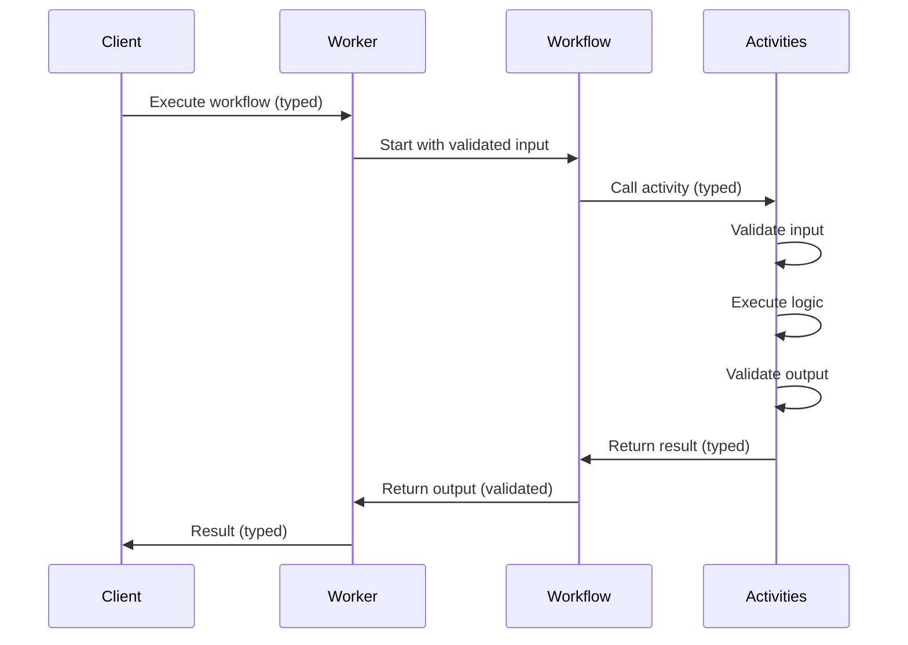
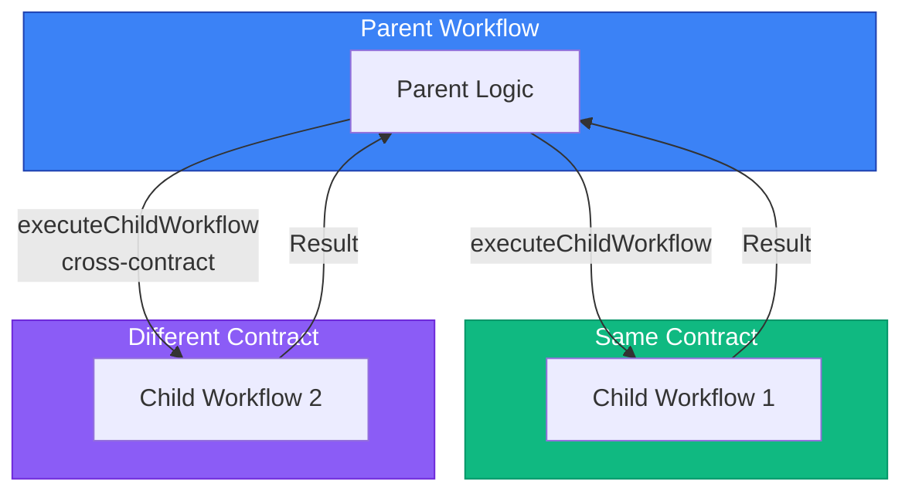

# Worker Implementation

This guide explains how to implement workers using temporal-contract.

## Overview

The `@temporal-contract/worker` package provides functions for implementing Temporal workers with full type safety:

1. **`declareActivitiesHandler`** - Implements all activities (global + workflow-specific)
2. **`declareWorkflow`** - Implements individual workflows with typed context

## Workflow Execution Flow



## Activities Handler

Create a handler for all activities using `AsyncResult`:

```typescript
import { declareActivitiesHandler, ApplicationFailure } from "@temporal-contract/worker/activity";
import { fromPromise } from "unthrown";
import { myContract } from "./contract";

export const activities = declareActivitiesHandler({
  contract: myContract,
  activities: {
    // Global activities - use AsyncResult for explicit error handling
    sendEmail: ({ to, subject, body }) =>
      fromPromise(emailService.send({ to, subject, body }), (error) =>
        ApplicationFailure.create({
          type: "EMAIL_FAILED",
          message: error instanceof Error ? error.message : "Failed to send email",
          cause: error instanceof Error ? error : undefined,
        }),
      ).map(() => ({ sent: true })),

    // Workflow-specific activities
    processPayment: ({ customerId, amount }) =>
      fromPromise(paymentGateway.charge(customerId, amount), (error) =>
        ApplicationFailure.create({
          type: "PAYMENT_FAILED",
          message: error instanceof Error ? error.message : "Payment failed",
          cause: error instanceof Error ? error : undefined,
        }),
      ).map((txId) => ({ transactionId: txId, success: true })),
  },
});
```

## Working with the Activity Context

`declareActivitiesHandler` accepts implementations in the
`AsyncResult<T, ApplicationFailure>` shape and wraps each one into an
ordinary Promise-returning Temporal activity (Temporal sees a normal
`(args) => Promise<Output>` handler at the runtime boundary). The
wrapper does **not** hide Temporal's `@temporalio/activity` runtime —
your activity body still runs in the regular activity context, so you
can call `Context.current()` directly to reach heartbeats, the last
heartbeat payload, the activity info, and async completion. The
contract surface stays focused on typed inputs and outputs while you
keep full access to Temporal's activity APIs.

### Heartbeat (long-running activities)

Use heartbeats so Temporal can detect a stalled worker via
`heartbeatTimeout` (a watchdog: each heartbeat resets the timer; if no
heartbeat arrives within the configured window, Temporal fails the
attempt and retries). Heartbeats do **not** extend `startToCloseTimeout` —
that bounds the absolute duration of a single attempt regardless of how
often you heartbeat, so size both timeouts with the activity's worst-
case runtime in mind.

Call `Context.current().heartbeat(details)` from inside your
`AsyncResult`-returning body — heartbeats are independent of the
`Result` wrapping. The example below uses the inline-implementation
pattern: TypeScript infers each activity's input/output shape from the
contract via `declareActivitiesHandler`'s `activities` parameter, so no
extra annotation is needed.

```typescript
import { Context } from "@temporalio/activity";
import { fromPromise } from "unthrown";
import { declareActivitiesHandler, ApplicationFailure } from "@temporal-contract/worker/activity";
import { reportContract } from "./contract";

export const activities = declareActivitiesHandler({
  contract: reportContract,
  activities: {
    exportLargeReport: ({ reportId }) =>
      fromPromise(
        runExport(reportId, ({ chunkIndex }) => {
          // Heartbeat the most recent progress checkpoint. Temporal records
          // this as the activity's `heartbeatDetails` for the next attempt.
          Context.current().heartbeat({ chunkIndex });
        }),
        (error) =>
          ApplicationFailure.create({
            type: "EXPORT_FAILED",
            message: error instanceof Error ? error.message : "Export failed",
            cause: error instanceof Error ? error : undefined,
          }),
      ).map(({ rowCount }) => ({ rowCount })),
  },
});
```

Configure `heartbeatTimeout` on the workflow side (`activityOptions` or
`activityOptionsByName`) — without it, Temporal cannot detect a silent
worker.

### Resuming after a retry (`heartbeatDetails`)

When Temporal retries a heartbeating activity, the previous attempt's
last `heartbeat(details)` payload is available on
`Context.current().heartbeatDetails`. Use it to skip work the previous
attempt already completed:

```typescript
import { Context } from "@temporalio/activity";
import { fromPromise } from "unthrown";
import { declareActivitiesHandler, ApplicationFailure } from "@temporal-contract/worker/activity";
import { reportContract } from "./contract";

export const activities = declareActivitiesHandler({
  contract: reportContract,
  activities: {
    exportLargeReport: ({ reportId }) => {
      // `heartbeatDetails` is typed as `unknown` — the contract surface
      // does not yet validate this payload (see issue #198 for the
      // typed-schema follow-up). Cast at the boundary if you need typed
      // access.
      const last = Context.current().heartbeatDetails as { chunkIndex: number } | undefined;
      const startFrom = last?.chunkIndex ?? 0;

      return fromPromise(runExport(reportId, { startFrom }), (error) =>
        ApplicationFailure.create({
          type: "EXPORT_FAILED",
          message: error instanceof Error ? error.message : "Export failed",
          cause: error instanceof Error ? error : undefined,
        }),
      ).map(({ rowCount }) => ({ rowCount }));
    },
  },
});
```

### Activity info (attempt number, workflow IDs)

`Context.current().info` exposes the running activity's metadata:
attempt number, workflow execution ID, task queue, schedule timestamps,
and so on. Useful for structured logging and conditional retry
behavior:

```typescript
import { Context } from "@temporalio/activity";
import { fromPromise } from "unthrown";
import { declareActivitiesHandler, ApplicationFailure } from "@temporal-contract/worker/activity";
import { paymentContract } from "./contract";

export const activities = declareActivitiesHandler({
  contract: paymentContract,
  activities: {
    chargePayment: ({ orderId, amount }) => {
      const { attempt, workflowExecution } = Context.current().info;
      logger.info("chargePayment attempt", {
        attempt,
        workflowId: workflowExecution.workflowId,
        orderId,
      });
      return fromPromise(paymentGateway.charge(orderId, amount), (error) =>
        ApplicationFailure.create({
          type: "PAYMENT_FAILED",
          message: error instanceof Error ? error.message : "Payment failed",
          cause: error instanceof Error ? error : undefined,
        }),
      ).map((transactionId) => ({ transactionId }));
    },
  },
});
```

### Async completion

Activities that pause and complete out of band (HTTP callback, message
queue, manual approval) use Temporal's standard async-completion
pattern: capture the task token, register the work somewhere external,
then throw `CompleteAsyncError` so the worker knows not to auto-complete
the activity. The activity completes later via `AsyncCompletionClient`
(usually from a different process).

Two outcomes need to coexist inside the activity body:

- **Success path** — registration succeeded: throw `CompleteAsyncError`.
  Temporal's worker recognizes this specific error class and parks the
  attempt instead of failing it.
- **Failure path** — registration threw: wrap the failure in
  `ApplicationFailure` so the regular retry/error semantics still apply.

The cleanest shape is an inner `async` function that throws either
class. `fromPromise` converts the rejection into an `Err`,
the activity wrapper rethrows whatever it finds there, and Temporal's
runtime recognizes the `CompleteAsyncError` class unchanged. The
`<never, ApplicationFailure>` type parameters acknowledge that the
contract advertises `ApplicationFailure` in the error slot — the
`CompleteAsyncError` is a runtime-only signal that never reaches the
caller, so the assertion is safe.

```typescript
import { Context, CompleteAsyncError } from "@temporalio/activity";
import { fromPromise } from "unthrown";
import { declareActivitiesHandler, ApplicationFailure } from "@temporal-contract/worker/activity";
import { approvalContract } from "./contract";

export const activities = declareActivitiesHandler({
  contract: approvalContract,
  activities: {
    awaitApproval: ({ requestId }) => {
      const taskToken = Context.current().info.taskToken;

      return fromPromise<never, ApplicationFailure>(
        (async () => {
          try {
            await enqueueApprovalRequest({ requestId, taskToken });
          } catch (error) {
            // Registration failure — surface as a normal ApplicationFailure.
            throw ApplicationFailure.create({
              type: "ENQUEUE_FAILED",
              message: error instanceof Error ? error.message : "Failed to enqueue request",
              ...(error instanceof Error ? { cause: error } : {}),
            });
          }
          // Don't-auto-complete signal. Temporal recognizes the
          // CompleteAsyncError class after the wrapper rethrows it.
          throw new CompleteAsyncError();
        })(),
        (e) => e as ApplicationFailure,
      );
    },
  },
});
```

The external system later finishes the activity by calling
[`AsyncCompletionClient`](https://typescript.temporal.io/api/classes/client.AsyncCompletionClient/)
with the task token (and a typed payload that satisfies the activity's
output schema, since validation runs on completion). The library does
not currently wrap `AsyncCompletionClient` — use it directly from
`@temporalio/client` in whichever process completes the activity.

### Where to draw the line

The contract surface aims to type **inputs and outputs** at the network
boundary. Activity-runtime concerns (heartbeats, attempt number, async
completion) are not part of the contract today and remain in
`@temporalio/activity`. Two follow-ups are sketched:

- **Typed heartbeat payloads** would land as a new
  `defineActivity({ heartbeatDetails: ... })` field with a typed
  `heartbeat(details)` / `heartbeatDetails()` accessor on an activity
  context handle. Tracked in #198.
- **A typed `AsyncCompletionClient` wrapper** is a separate path —
  there's no specific API shape proposed yet. Open a new issue if a
  concrete use case shows up.

## Workflow Implementation

Implement workflows with typed context. Activities called from workflows return plain values (Result is unwrapped internally):

```typescript
import { declareWorkflow } from "@temporal-contract/worker/workflow";
import { myContract } from "./contract";

export const processOrder = declareWorkflow({
  workflowName: "processOrder",
  contract: myContract,
  activityOptions: { startToCloseTimeout: "1 minute" },
  implementation: async (context, args) => {
    // context.activities is fully typed
    // Activities return plain values (Result is unwrapped by the framework)
    const payment = await context.activities.processPayment({
      customerId: args.customerId,
      amount: 100,
    });

    await context.activities.sendEmail({
      to: args.customerId,
      subject: "Order Confirmed",
      body: "Your order has been processed",
    });

    // Return plain object (not Result)
    return {
      status: payment.success ? "success" : "failed",
      transactionId: payment.transactionId,
    };
  },
});
```

### Per-activity options

`activityOptions` applies to every activity reachable from the workflow. To
override timeouts or retry policy for a specific activity, add
`activityOptionsByName`. Each entry shallow-merges over the workflow default;
the override wins on every property it specifies, including the entire nested
`retry` block (matching Temporal's "one `ActivityOptions` per
`proxyActivities` call" semantics).

```typescript
export const processOrder = declareWorkflow({
  workflowName: "processOrder",
  contract: myContract,
  activityOptions: {
    startToCloseTimeout: "1 minute",
  },
  activityOptionsByName: {
    // Payment gateway is slow and worth retrying aggressively
    processPayment: {
      startToCloseTimeout: "5 minutes",
      retry: { maximumAttempts: 5 },
    },
    // Cheap CPU-bound check — fail fast if it stalls
    validateOrder: {
      startToCloseTimeout: "5 seconds",
    },
  },
  implementation: async (context, args) => {
    // ...
  },
});
```

Activity names in `activityOptionsByName` are constrained to the contract's
declared activities (workflow-local + global), so typos surface at compile
time rather than running silently with the default options.

## Worker Setup

Set up the Temporal worker:

```typescript
import { Worker } from "@temporalio/worker";
import { activities } from "./activities";

const worker = await Worker.create({
  workflowsPath: require.resolve("./workflows"),
  activities,
  taskQueue: "my-task-queue", // or myContract.taskQueue
});

await worker.run();
```

## Type Safety Features

### Input Validation

All activity and workflow inputs are automatically validated:

```typescript
// ✅ Valid - matches schema
await context.activities.processPayment({
  customerId: "CUST-123",
  amount: 100,
});

// ❌ Invalid - throws validation error
await context.activities.processPayment({
  customerId: 123, // Should be string
  amount: -10, // Should be positive
});
```

### Output Validation

Return values are validated against output schemas:

```typescript
// ✅ Valid
return { transactionId: "TXN-123", success: true };

// ❌ Invalid - TypeScript error + runtime validation
return { txId: "TXN-123" }; // Wrong field name
```

### Typed Context

The workflow context is fully typed based on your contract:

```typescript
implementation: async (context, args) => {
  // TypeScript knows all available activities
  context.activities.processPayment; // ✅ Available
  context.activities.unknownActivity; // ❌ TypeScript error

  // Full autocomplete for parameters
  await context.activities.processPayment({
    // IDE shows: customerId: string, amount: number
  });
};
```

## Child Workflows

Execute child workflows with the type-safe `Result` / `AsyncResult` pattern. Child workflows can be from the same contract or from a different contract (cross-worker communication).



### Basic Usage

```typescript
import { declareWorkflow } from "@temporal-contract/worker/workflow";
import { myContract, notificationContract } from "./contracts";

export const parentWorkflow = declareWorkflow({
  workflowName: "parentWorkflow",
  contract: myContract,
  activityOptions: { startToCloseTimeout: "1 minute" },
  implementation: async (context, args) => {
    // Execute child workflow from same contract and wait for result
    const result = await context.executeChildWorkflow(myContract, "processPayment", {
      workflowId: `payment-${args.orderId}`,
      args: { amount: args.totalAmount },
    });

    result.match({
      ok: (output) => console.log("Payment processed:", output),
      err: (error) => console.error("Payment failed:", error),
      defect: (cause) => console.error("Unexpected failure:", cause),
    });

    return { success: true };
  },
});
```

### Cross-Contract Child Workflows

Invoke child workflows from different contracts and workers:

```typescript
import { isErr } from "unthrown";

export const orderWorkflow = declareWorkflow({
  workflowName: "processOrder",
  contract: orderContract,
  activityOptions: { startToCloseTimeout: "1 minute" },
  implementation: async (context, args) => {
    // Process payment in same contract
    const paymentResult = await context.executeChildWorkflow(orderContract, "processPayment", {
      workflowId: `payment-${args.orderId}`,
      args: { amount: args.total },
    });

    // Free-function narrowing — the `.isErr()` method would not narrow the type.
    if (isErr(paymentResult)) {
      return { status: "failed", reason: "payment" };
    }

    // Send notification using another worker's contract
    const notificationResult = await context.executeChildWorkflow(
      notificationContract,
      "sendOrderConfirmation",
      {
        workflowId: `notify-${args.orderId}`,
        args: { orderId: args.orderId, email: args.customerEmail },
      },
    );

    return {
      status: "completed",
      transactionId: paymentResult.value.transactionId,
    };
  },
});
```

### Start Without Waiting

Use `startChildWorkflow` to start a child workflow without waiting for its result:

```typescript
export const orderWorkflow = declareWorkflow({
  workflowName: "processOrder",
  contract: myContract,
  activityOptions: { startToCloseTimeout: "1 minute" },
  implementation: async (context, args) => {
    // Start background notification workflow
    const handleResult = await context.startChildWorkflow(notificationContract, "sendEmail", {
      workflowId: `email-${args.orderId}`,
      args: { to: args.customerEmail, subject: "Order received" },
    });

    handleResult.match({
      ok: async (handle) => {
        // Child workflow started successfully
        // Can wait for result later if needed
        const result = await handle.result();
      },
      err: (error) => {
        console.error("Failed to start notification:", error);
      },
      defect: (cause) => {
        console.error("Unexpected failure starting notification:", cause);
      },
    });

    return { success: true };
  },
});
```

### Error Handling

Child workflow errors are returned as `ChildWorkflowError`:

```typescript
const result = await context.executeChildWorkflow(myContract, "processPayment", {
  workflowId: "payment-123",
  args: { amount: 100 },
});

result.match({
  ok: (output) => {
    // Child workflow completed successfully
    console.log("Transaction ID:", output.transactionId);
  },
  err: (error) => {
    // Handle child workflow errors
    if (error instanceof ChildWorkflowNotFoundError) {
      console.error("Workflow not found in contract");
    } else {
      console.error("Child workflow failed:", error.message);
    }
  },
  defect: (cause) => {
    // Unexpected failure (bug), not a modeled child-workflow error
    console.error("Unexpected failure:", cause);
  },
});
```

## Best Practices

### 1. Separate Activity Files

Organize activities by domain:

```typescript
// activities/payment.ts
import { fromPromise } from "unthrown";
import { ApplicationFailure } from "@temporal-contract/worker/activity";

export const paymentActivities = {
  processPayment: ({ customerId, amount }) =>
    fromPromise(paymentGateway.charge(customerId, amount), (err) =>
      ApplicationFailure.create({
        type: "PAYMENT_FAILED",
        message: err instanceof Error ? err.message : "Payment failed",
        cause: err instanceof Error ? err : undefined,
      }),
    ).map((tx) => ({ transactionId: tx.id })),
  refundPayment: ({ transactionId }) =>
    fromPromise(paymentGateway.refund(transactionId), (err) =>
      ApplicationFailure.create({
        type: "REFUND_FAILED",
        message: err instanceof Error ? err.message : "Refund failed",
        cause: err instanceof Error ? err : undefined,
      }),
    ).map(() => ({ refunded: true })),
};

// activities/email.ts
import { fromPromise } from "unthrown";
import { ApplicationFailure } from "@temporal-contract/worker/activity";

export const emailActivities = {
  sendEmail: ({ to, subject, body }) =>
    fromPromise(emailService.send({ to, subject, body }), (err) =>
      ApplicationFailure.create({
        type: "EMAIL_FAILED",
        message: err instanceof Error ? err.message : "Email failed",
        cause: err instanceof Error ? err : undefined,
      }),
    ).map(() => ({ sent: true })),
};

// activities/index.ts
import { declareActivitiesHandler } from "@temporal-contract/worker/activity";
import { paymentActivities } from "./payment";
import { emailActivities } from "./email";

export const activities = declareActivitiesHandler({
  contract: myContract,
  activities: {
    ...paymentActivities,
    ...emailActivities,
  },
});
```

### 2. Use Dependency Injection

Make activities testable:

```typescript
import { fromPromise } from "unthrown";
import { ApplicationFailure } from "@temporal-contract/worker/activity";

export const createActivities = (services: {
  emailService: EmailService;
  paymentGateway: PaymentGateway;
}) =>
  declareActivitiesHandler({
    contract: myContract,
    activities: {
      sendEmail: ({ to, subject, body }) =>
        fromPromise(services.emailService.send({ to, subject, body }), (err) =>
          ApplicationFailure.create({
            type: "EMAIL_FAILED",
            message: err instanceof Error ? err.message : "Email failed",
            cause: err instanceof Error ? err : undefined,
          }),
        ).map(() => ({ sent: true })),
      processPayment: ({ customerId, amount }) =>
        fromPromise(services.paymentGateway.charge(customerId, amount), (err) =>
          ApplicationFailure.create({
            type: "PAYMENT_FAILED",
            message: err instanceof Error ? err.message : "Payment failed",
            cause: err instanceof Error ? err : undefined,
          }),
        ).map((txId) => ({ transactionId: txId, success: true })),
    },
  });
```

### 3. Error Handling

Activities use `AsyncResult` for explicit error handling:

```typescript
import { declareActivitiesHandler, ApplicationFailure } from "@temporal-contract/worker/activity";
import { fromPromise } from "unthrown";

export const activities = declareActivitiesHandler({
  contract: myContract,
  activities: {
    processPayment: ({ customerId, amount }) =>
      fromPromise(paymentGateway.charge(customerId, amount), (error) => {
        // Wrap technical errors in ApplicationFailure so Temporal's
        // retry policy applies; set `nonRetryable: true` for permanent
        // failures (e.g. card declined) so retries don't fire.
        return ApplicationFailure.create({
          type: "PAYMENT_FAILED",
          message: error instanceof Error ? error.message : "Payment failed",
          ...(error instanceof Error ? { cause: error } : {}),
        });
      }).map((txId) => ({ transactionId: txId, success: true })),
  },
});
```

In workflows, activities return plain values. If an activity fails, it will throw an error that can be caught:

```typescript
export const processOrder = declareWorkflow({
  workflowName: "processOrder",
  contract: myContract,
  activityOptions: { startToCloseTimeout: "1 minute" },
  implementation: async (context, args) => {
    try {
      // Activity returns plain value if successful
      const payment = await context.activities.processPayment({
        customerId: args.customerId,
        amount: 100,
      });

      return {
        status: "success",
        transactionId: payment.transactionId,
      };
    } catch (error) {
      // Activity errors are thrown and can be caught
      console.error("Payment failed:", error);

      return {
        status: "failed",
        transactionId: "",
      };
    }
  },
});
```

## See Also

- [Entry Points Architecture](/guide/entry-points)
- [Activity Handler Types](/guide/activity-handlers)
- [Examples](/examples/)
